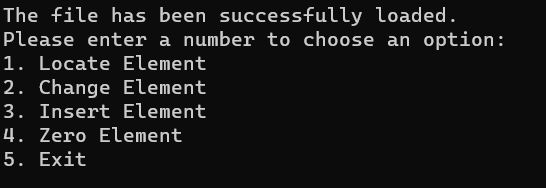
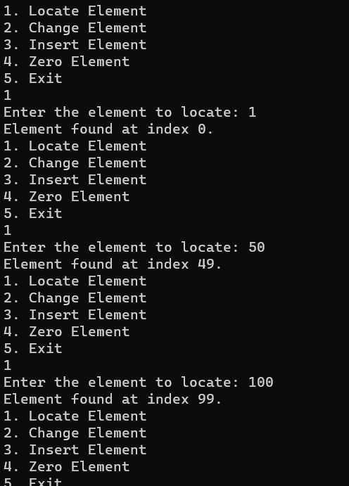
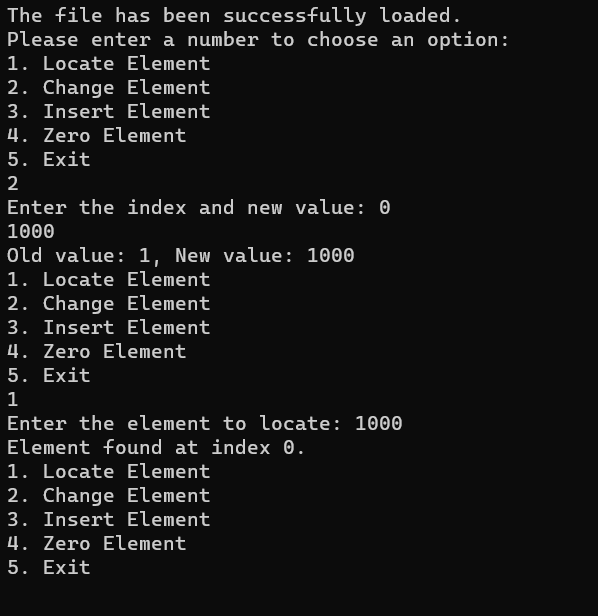
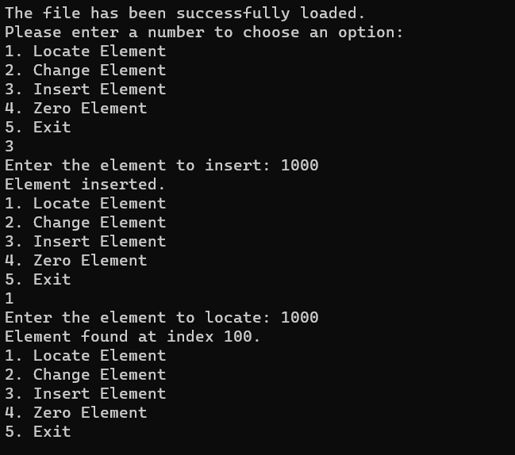
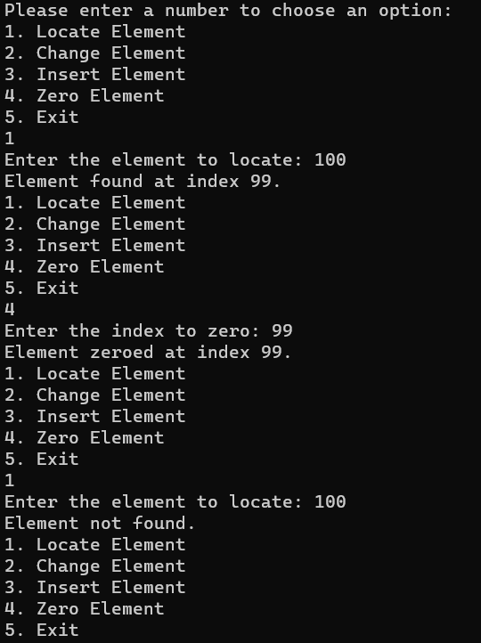

# Assignment1
## How to Run the Code

1. Download the `Assignment1.cpp` and `Assignment1.h` files.
2. Create a `data.txt` file containing integers, each separated by a new line.
3. Place `Assignment1.cpp`, `Assignment1.h`, and `data.txt` in the same directory.
4. Open the files in a C++ compiler.
5. Compile and execute the program.

## Screenshots

*Screenshot of the menu options.*

*Screenshot of finding an element in the array.*

*Screenshot of changing an array element.*

*Screenshot of adding a new element.*

*Screenshot of setting an element to zero.*
